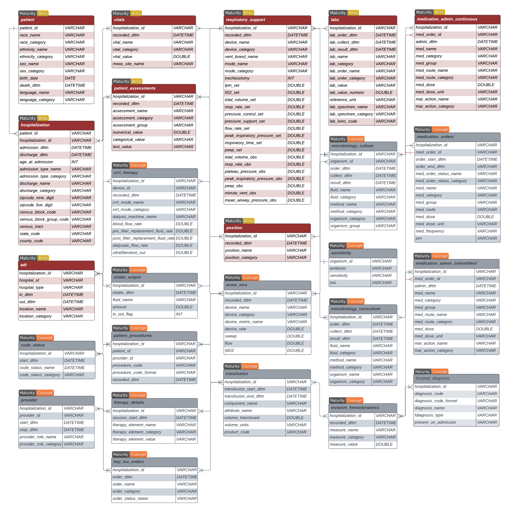

## Tokenization intro (internal)

-   Our tokenizer operates on raw clif data that lives in parquet files. I've
    placed a small development sample in
    `/gpfs/data/bbj-lab/users/burkh4rt/development-sample` and fixed permissions
    so you (a person in the `cri-bbj_lab` group) should have full r/w/x access:

          ```
          /gpfs/data/bbj-lab/users/burkh4rt/development-sample
          ├── raw
          │   ├── clif_adt.parquet
          │   ├── clif_hospitalization.parquet
          │   ├── clif_labs.parquet
          │   ├── clif_medication_admin_continuous.parquet
          │   ├── clif_patient_assessments.parquet
          │   ├── clif_patient.parquet
          │   ├── clif_position.parquet
          │   ├── clif_respiratory_support.parquet
          │   └── clif_vitals.parquet
          └── split
          ```

    Each of these tables corresponds to the the CLIF-2.0.0 schema --
    

-   The first thing we do to this data is create a train/val/test split. On
    randi, we can run

          ```sh
          systemd-run --scope --user tmux new -s t3q
          srun -p tier3q \
               --mem=32GB \
               --time=5:00:00 \
               --job-name=adhoc \
               --pty bash -i
          conda activate apptainer
          export hm=/gpfs/data/bbj-lab/users/burkh4rt
          export env_container=$hm/env.sif
          export PYTHONPATH="/src:$PYTHONPATH"
          python3() {
              apptainer exec --nv \
                  --bind $hm/development-sample:$hm/development-sample \
                  "$env_container" python3 "$@"
          }
          python3 /src/fms_ehrs/scripts/create_train_val_test_split.py \
              --data_dir_in "$hm/development-sample/raw" \
              --data_dir_out "$hm/development-sample" \
              --data_version_out split \
              --train_frac 0.7 \
              --val_frac 0.1
          ```

    (We essentially alias `python3` to be a call to python in an
    [apptainer container](https://apptainer.org).) Our logging system should then
    spit out some fun facts at you:

          ```
          [2025-08-15T11:16:58-0500] running /src/fms_ehrs/scripts/create_train_val_test_split.py
          [2025-08-15T11:16:58-0500] from /scratch/burkh4rt/test
          [2025-08-15T11:16:58-0500] with Python 3.12.11 (main, Jul 22 2025, 04:27:29) [GCC 10.2.1 20210110]
          [2025-08-15T11:16:58-0500] on cri22cn301
          [2025-08-15T11:16:58-0500] tz-info: CDT
          [2025-08-15T11:16:58-0500] slurm job id: 63484681
          [2025-08-15T11:16:58-0500] main called with---
          [2025-08-15T11:16:58-0500] data_version_out: split
          [2025-08-15T11:16:58-0500] data_dir_in: /gpfs/data/bbj-lab/users/burkh4rt/development-sample/raw
          [2025-08-15T11:16:58-0500] data_dir_out: /gpfs/data/bbj-lab/users/burkh4rt/development-sample
          [2025-08-15T11:16:58-0500] train_frac: 0.7
          [2025-08-15T11:16:58-0500] val_frac: 0.1
          [2025-08-15T11:16:58-0500] valid_admission_window: None
          [2025-08-15T11:16:58-0500] Patients n_total=10000
          [2025-08-15T11:16:58-0500] Partition: n_train=7000, n_val=1000, n_test=2000
          [2025-08-15T11:16:58-0500] Hospitalizations n_total=20586
          [2025-08-15T11:16:58-0500] Partition: h_ids['train'].n_unique()=14482, h_ids['val'].n_unique()=1967, h_ids['test'].n_unique()=4137
          [2025-08-15T11:17:02-0500] ---main
          ```

    And afterwards a call to `tree $hm/development-sample` should look like this:

          ```
          /gpfs/data/bbj-lab/users/burkh4rt/development-sample
          ├── raw
          │   ├── clif_adt.parquet
          │   ├── clif_hospitalization.parquet
          │   ├── clif_labs.parquet
          │   ├── clif_medication_admin_continuous.parquet
          │   ├── clif_patient_assessments.parquet
          │   ├── clif_patient.parquet
          │   ├── clif_position.parquet
          │   ├── clif_respiratory_support.parquet
          │   └── clif_vitals.parquet
          └── split
              ├── test
              │   ├── clif_adt.parquet
              │   ├── clif_hospitalization.parquet
              │   ├── clif_labs.parquet
              │   ├── clif_medication_admin_continuous.parquet
              │   ├── clif_patient_assessments.parquet
              │   ├── clif_patient.parquet
              │   ├── clif_position.parquet
              │   ├── clif_respiratory_support.parquet
              │   └── clif_vitals.parquet
              ├── train
              │   ├── clif_adt.parquet
              │   ├── clif_hospitalization.parquet
              │   ├── clif_labs.parquet
              │   ├── clif_medication_admin_continuous.parquet
              │   ├── clif_patient_assessments.parquet
              │   ├── clif_patient.parquet
              │   ├── clif_position.parquet
              │   ├── clif_respiratory_support.parquet
              │   └── clif_vitals.parquet
              └── val
                  ├── clif_adt.parquet
                  ├── clif_hospitalization.parquet
                  ├── clif_labs.parquet
                  ├── clif_medication_admin_continuous.parquet
                  ├── clif_patient_assessments.parquet
                  ├── clif_patient.parquet
                  ├── clif_position.parquet
                  ├── clif_respiratory_support.parquet
                  └── clif_vitals.parquet
          ```

-   Next we're prepared to do our actual tokenization, with the call:

            ```sh
            python3 /src/fms_ehrs/scripts/tokenize_train_val_test_split.py \
                --data_dir "$hm/development-sample/" \
                --data_version_in split \
                --data_version_out vanilla \
                --max_padded_len 1024 \
                --day_stay_filter True \
                --include_24h_cut True \
                --drop_nulls_nans True \
                2>&1 | tee -a ~/$SLURM_JOBID.stdout
            ```

    We should get a decent amount of logging out of this call, and it gets teed
    into an stdout file in your home directory. This shows you some example
    timelines, summary stats and other fun stuff. This also extends our
    filesystem a bit:

          ```
          /gpfs/data/bbj-lab/users/burkh4rt/development-sample
          ├── raw
          │   ├── clif_adt.parquet
          │   ├── clif_hospitalization.parquet
          │   ├── clif_labs.parquet
          │   ├── clif_medication_admin_continuous.parquet
          │   ├── clif_patient_assessments.parquet
          │   ├── clif_patient.parquet
          │   ├── clif_position.parquet
          │   ├── clif_respiratory_support.parquet
          │   └── clif_vitals.parquet
          ├── split
          │   ├── test
          │   │   ├── clif_adt.parquet
          │   │   ├── clif_hospitalization.parquet
          │   │   ├── clif_labs.parquet
          │   │   ├── clif_medication_admin_continuous.parquet
          │   │   ├── clif_patient_assessments.parquet
          │   │   ├── clif_patient.parquet
          │   │   ├── clif_position.parquet
          │   │   ├── clif_respiratory_support.parquet
          │   │   └── clif_vitals.parquet
          │   ├── train
          │   │   ├── clif_adt.parquet
          │   │   ├── clif_hospitalization.parquet
          │   │   ├── clif_labs.parquet
          │   │   ├── clif_medication_admin_continuous.parquet
          │   │   ├── clif_patient_assessments.parquet
          │   │   ├── clif_patient.parquet
          │   │   ├── clif_position.parquet
          │   │   ├── clif_respiratory_support.parquet
          │   │   └── clif_vitals.parquet
          │   └── val
          │       ├── clif_adt.parquet
          │       ├── clif_hospitalization.parquet
          │       ├── clif_labs.parquet
          │       ├── clif_medication_admin_continuous.parquet
          │       ├── clif_patient_assessments.parquet
          │       ├── clif_patient.parquet
          │       ├── clif_position.parquet
          │       ├── clif_respiratory_support.parquet
          │       └── clif_vitals.parquet
          ├── vanilla_first_24h-tokenized
          │   ├── test
          │   │   └── tokens_timelines.parquet
          │   ├── train
          │   │   ├── tokens_timelines.parquet
          │   │   └── vocab.gzip
          │   └── val
          │       └── tokens_timelines.parquet
          └── vanilla-tokenized
              ├── test
              │   └── tokens_timelines.parquet
              ├── train
              │   ├── tokens_timelines.parquet
              │   └── vocab.gzip
              └── val
                  └── tokens_timelines.parquet
          ```

    Here, `vanilla-tokenized` contains tokenized timelines and the `*_first_24h*`
    designation contains versions of these timelines truncated at 24h. The
    training split always holds the corresponding `vocab.gzip`
    [vocabulary object](./fms_ehrs/framework/vocabulary.py).

-   We can also open an interactive session with `python3 -i` and play around a
    bit with the [tokenizer object](./fms_ehrs/framework/tokenizer.py) directly:

          ```py
          import pathlib

          from fms_ehrs.framework.tokenizer import ClifTokenizer

          hm = pathlib.Path("/gpfs/data/bbj-lab/users/burkh4rt")

          tkzr = ClifTokenizer(
              data_dir=hm.joinpath("development-sample", "split", "train"),
              max_padded_len=1024,
              day_stay_filter=True,
              drop_nulls_nans=True,
          )
          tt = tkzr.get_tokens_timelines()
          ```

    At this point, calling:

    -   `tt` will show a dataframe with columns `hospitalization_id`, `tokens`,
        and `times`.
    -   `tkzr.print_aux()` will show all the "auxiliary information" on learned
        decile cutoff points.
    -   `tkzr.tbl` will show a dictionary of processed clif tables.
    -   `tkzr.vocab.lookup` will show the lookup dictionary for our learned
        vocabulary object. This just maps tokens to integers.
    -   `summarize(tkzr, tt)` will give you some more readouts.
